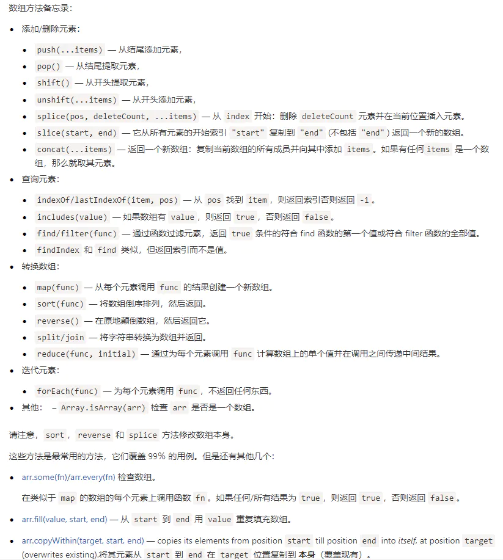

参考链接
JS数组奇巧淫技
https://juejin.im/post/5d71fff5f265da03e4678328
25个你不得不知道的数组reduce高级用法
https://juejin.im/post/5e44002c6fb9a07c9f3fd135
> 会改变数组自身的方法
> - splice()、sort()、reverse()
> - push()、pop()、shift()、unshift()
> - fill()、copyWithin()

#### 基本用法

##### 生成类似[1 - 100]这样的数组
```javascript
// fill
const arr = new Array(100).fill(0).map((item, index) => index + 1)

// Array.from()
const arr = Array.from(Array(100), (v, k) => k + 1)

// ... + array.keys()
const ary = [...Array(100).keys()] 
```
##### 数组浅拷贝
```javascript
const arr = [1, 2, 3]
const arrClone1 = [...arr]
const arrClone2 = arr4.slice(0, arr4.length)
const arrClone3 = Array.from(arr4)
// 对象也可以这样浅拷贝
const obj = { a: 1 }
const objClone = { ...obj }
```
##### 数组合并
```javascript
const arr5 = [4, 5, 6]
const arrMerge1 = [...arr4, ...arr5]
const arrMerge2 = arr4.concat(arr5)
```
##### 数组去重
```javascript
const arr6 = [1, 1, 2, 3, 4, 4]
const arrRemove = [...new Set(arr6)]
// 等同于 Array.from(new Set(arr))

// ES5
const arr7 = arr6.filter( (element, index, self) => {
    return self.indexOf( element ) === index;
});
```
##### 扁平化数组去重（排序）
```js
// ES6
var arr = [[1, 2, 2], [3, 4, 5, 5], [6, 7, 8, 9, [11, 12, [12, 13, [14]]]], 10];
var arr1 = Array.from(new Set(arr.flat(Infinity))).sort((a, b) => { return a - b });

// ES5
var flatArr = arr.toString().split(',').filter(function (element, index, self) {
    return self.indexOf(element) === index;
})
var newArr = flatArr.sort(function (a, b) { return a - b }).map(Number);
console.log(newArr);
```

##### 数组取并集（Union）、交集（Intersect）和差集（Difference）
```javascript
let a = new Set([1, 2, 3]);
let b = new Set([4, 3, 2]);

// 并集
let union = new Set([...a, ...b]);
// Set {1, 2, 3, 4}

// 交集
let intersect = new Set([...a].filter(x => b.has(x)));
// set {2, 3}

// （a 相对于 b 的）差集
let difference = new Set([...a].filter(x => !b.has(x)));
// Set {1}
```
##### 数组转对象
```javascript
const arrObj1 = { ...arr6 }
```
##### 数组摊平
二维数组用array.flat()，三维及以上用array.flatMap()
```javascript
const obj = { a: 'happy', b: 'fine', c: 'well' }
const getName = function (item) { return item.includes('e') }
const arrFlat = Object.values(obj).flat().filter(getName)
```
#### 常用遍历
forEach、every、some、filter、map、reduce、reduceRight、find、findIndex 等方法

#### 差别比较
##### array.includes() 和 array.indexOf()
- array.includes() 返回布尔值
- array.indexOf() 返回数组子项的索引[在需要索引值的情况下使用]
##### array.find() 、 array.findIndex() 和 array.some()
- array.find() 在需要数组的子项的时候使用
- array.findIndex() 需要子项的索引值的时候使用
- array.some() 只需要知道有无符合条件的子项时使用
**这三个都是短路操作，即找到符合条件的之后就不再继续遍历**
##### array.find() 和 array.filter()
- array.filter() 返回的是所有符合条件的子项组成的数组，会遍历所有数组
- array.find() 只返回第一个符合条件的子项，是短路操作
***
附上一张图
